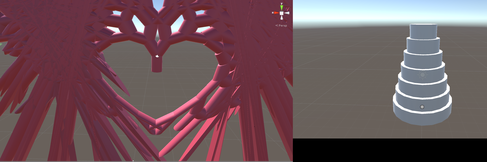
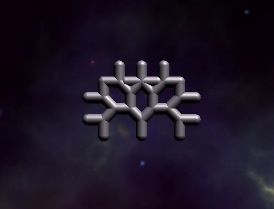
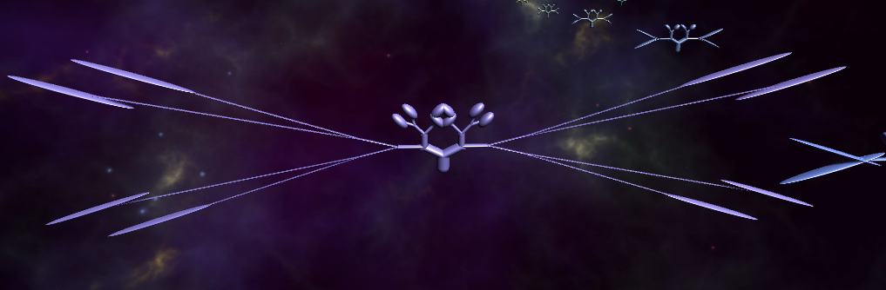
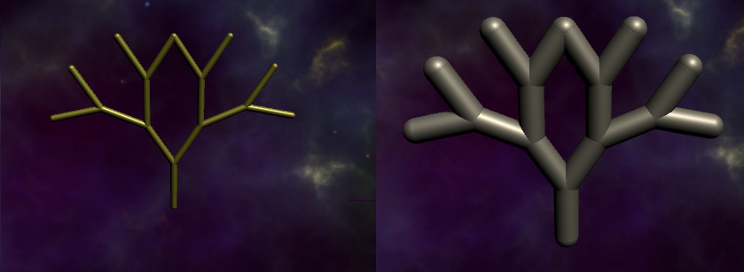

---
path: "/blog/2016-09-26"
date: "2016-09-26"
title: "Rotating Children of a Non-Uniformly Scaled Parent without Deformation in Unity"
---   

When I was creating <a href="https://drive.google.com/drive/u/1/folders/0B3awpsZxDZ3mMWJ0OXZYM2tMcjQ">Evol</a>, my evolutionary fractal generation program, I ran into a well known problem in Unity. When you child objects to a non-uniformly scaled parent (i.e., a parent whose x, y, and z scale values are different), rotating the children makes them skewed.

Since fractals are by their nature hierarchical, this produced some strange results when I wanted to thicken the branches of the fractals. 

While I was touched when Unity made me a heart and tiered wedding cake, this isn't what I wanted.

Wanted this
  

Got this
  

There are a couple of ways to circumvent this problem, as per aldonaletto's answer [here](http://answers.unity3d.com/questions/197739/object-skewing-on-rotation.html). One is to parent your rotated objects and your non-uniformly scaled object to an empty, uniformly scaled object. I didn't choose this approach because it was important to me that the object hierarchy remain unchanged.

Another solution is to create the objects in their correct scale in an external 3D modeling program such as Blender. This way, you can leave the scale as 1,1,1 in Unity. I couldn't do it this way since my intention was to create several objects with different scales programmatically. 

My solution was to forgo Unity's built in scale system altogether and manually edit the mesh myself. While I can't guarantee this will work for any models more complex than the simple cylinders that comprise my fractals' branches, it worked well for me.

<pre><code>public static void Scale (MeshFilter originalMesh, float x, float y, float z)
{
  Vector3[] verts = originalMesh.mesh.vertices; // get all vertices from the mesh

  for (int i = 0; i < verts.Length; i++)
    verts[i] = Vector3.Scale(verts[i], new Vector3(x, y, z)); // scale the vertices
    
  originalMesh.mesh.vertices = verts; // reassign the vertices back to the mesh
}</code></pre>

Then I just called it like this...

...and voila!

